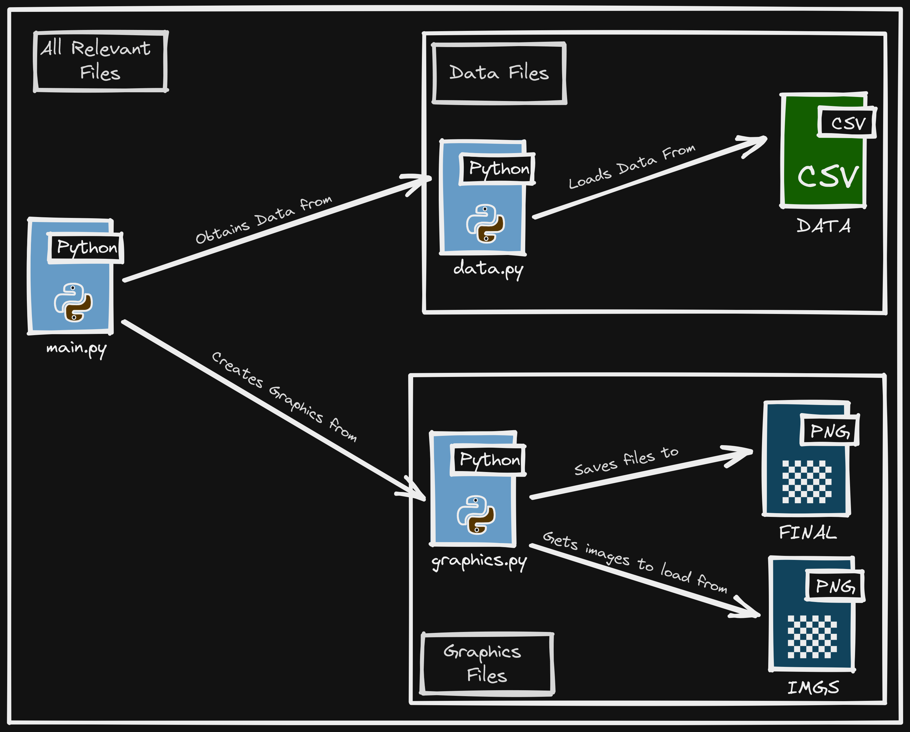

# Satisfactory Loot Maps
This python program generates Satisfactory Loot Maps using CSV data that holds crash site and item drop information. The program consists of three files - `main.py`, `data.py`, and `graphics.py`. Main is the main program, data handles reading from the CSV data, and graphics does all of the matplotlib and drawing work.

Video on Satisfactory Loot Maps can be found [here](https://youtu.be/Uh9rmpF6Kw0).

## Example Satisfactory Maps

### Unique Items With HD Requirements


### Actual Item Positions


### Unique Items With AWESOME Sink Point Values


***(More images can be found under the `final` folder)***


## How To Download And Run
### Cloning Repo
```sh
git clone https://github.com/klforthwind/SatisfactoryLootMaps.git
```

### Install Instructions
```sh
pip3 install -r requirements.txt
```

### Updating Crash Site Functions
In `graphics.py`, there is dictionary holding function pointers, all listed with a letter string value. `data/hard_drives.csv` contains a column called `Type`, which holds a letter representing which function you want the program to use per crash site. This allows for you to make a function per crash site if you really wanted to. At the moment, there are functions that draw doggos (Hidden Cove nodes), along with functions for the actual crash sites.

### Running The Code
```sh
python3 main.py <output_filename>
# output_filename defaults to 'output.png' if left blank
# Map will be saved to folder 'final'
```

## Code Structure
### SatisfactoryLootMaps
```
.
├── data                    # CSV files containing game data
├── final                   # Final images of generated loot maps
├── img                     # Image files for README.md
├── imgs                    # Image files for SatisfactoryLootMaps program
├── data.py                 # Data File - handles data transformation and reading from CSV files
├── graphics.py             # Graphics File - handles Matplotlib drawing / drawing functions
├── main.py                 # Main file that handles the interaction between other python files
└── README.md
```

## Software Design

